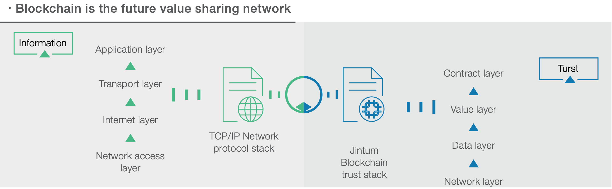

# SWTC blockchain !heading

in 2011, Bitcoin was first introduced, and SWTC's entrepreneurial team studied Bitcoin's kernel technology “blockchain” as an emerging technology for changing the way of human society is organized in the future. in 2014, the SWTC Public Chain was launched to the market.

SWTC Public Chain had operated successfully for 5 years already, 12 million blocks height (as of May 2019), 5000 TPS in commercial public chain could be met. The vision of SWTC Public Chain is to provide a safe, valid, credible commercial blockchain environment. at the same time, The SWTC Public Chain is also positioned as a decentralized trading platform that accommodates a variety of digital assets.

Blockchain technology firstly solved data source from multiple parties to be trustable and allow different data assets could be transacted. it could help to prevent “double consumption” problem, which could greatly reduce the cost of mutual trust in multi-party and boost the sharing of value in low cost. 

The SWTC blockchain is a trust machine.

Comparison of Major Blockchain Technology Functions

Topic|BTC|ETH|Hyperledger|Ripple/Stellar|SWTC
:--:|:--:|:--:|:--:|:--:|:--:
consensus mechanism|PoW|PoW|DIP type|Consensus|RBFT
Multi-assets|N|Contract|Contract|Native|Native
Asset exchange|N|Contract|Contract|Native|Native
Smart contract|N|Y|Y|N|Y
Performance|Weak|Weak|Good|Fair|Good
Number of nodes|Very much|A few|No public chain|Fair|Fair
