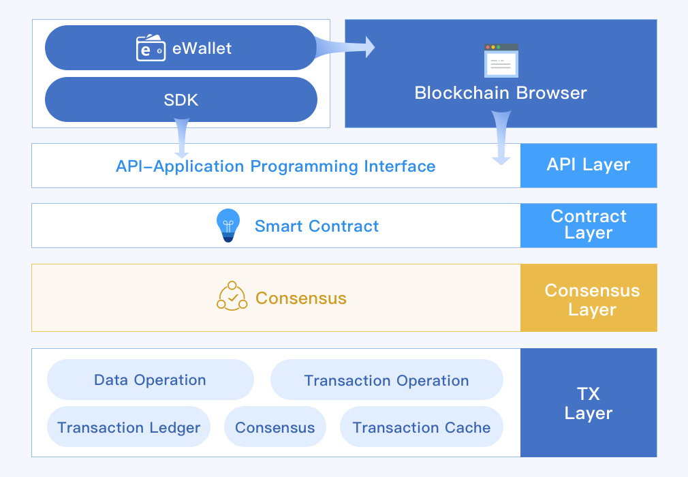
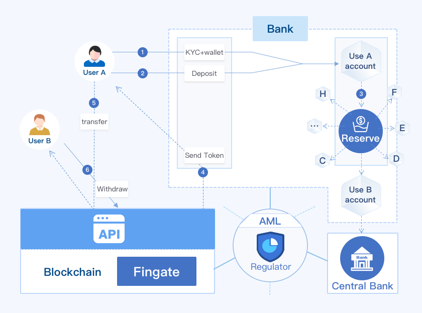
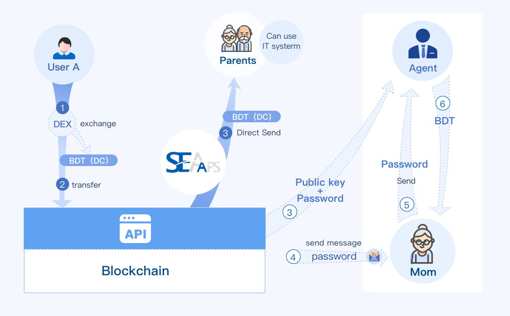

# Software architecture !heading

The actual combination of blockchain and financial services is different from traditional centralized systems in terms of software architecture. This chapter not only explains through the architecture, but also explains the application in different scenarios.

## Overview

The software architecture of financial applications is as follows:

As an application, for example (eWallet), the ability to access blockchain services is obtained by integrating the SDK. In the area below the API, it can be regarded as a blockchain node service. There are many such nodes in the entire blockchain network. Applications can choose any node and can run.

The design of the blockchain is based on the credible purpose of the ledger. Therefore, the blockchain API is inefficient for statistical classification and query of transactions. Usually, this responsibility is performed by the browser service.

## Payment

As a bank, to use the blockchain for payment, you need to map the real funds and the tokens circulating on the blockchain. The business framework is as follows:

1. The user (company) registers the blockchain wallet, completes KYC at the bank, and binds the user with the bank account;
2. The user (company) deposits currency to the bank;
3. After receiving the currency, the bank transfers the corresponding funds from the user's bank account to an escrow fund pool account;
4. The bank then transfers the digital currency to the user's wallet;
5. Users can pay digital currency directly to user B’s wallet;
6. If user B needs to withdraw cash into his bank account, he just transfers it out of the blockchain wallet to his bank account(Fingate);
7. After the bank detects the change of funds, according to the transaction request, it transfers the funds in the fund pool to the bank account of user B;
8. Regulatory nodes supervises payment activities on the blockchain to meet anti-money laundering (AML) regulatory requirements. Each wallet is KYC-made.

The funds in the capital pool(Reserve) in the figure are the sum of the asset tokens circulating on the blockchain, and the amounts on both sides are exactly the same.

## Remittance

For the remittance, the blockchain-based process is as follows:

For users who will use mobile APP, after receiving the token, they can use the APP to pay directly, or withdraw the funds to their bank account through the bank's fingate.

For users without a bank account, the sender can use double encryption to send money.

1. The sender transfers the token to the withdrawal point wallet closest to the recipient, and the note is double encrypted with the withdrawal point wallet address and the password specified by the sender;
1. The sender informs the recipient of the password via other way such as SMS, phone;
1. The recipient goes to the withdrawal point and tells the password. The withdrawal point uses the wallet private key that only he knows and password to decrypt it, and obtains the note information. After verifying the recipient's identity, the payment is made;
