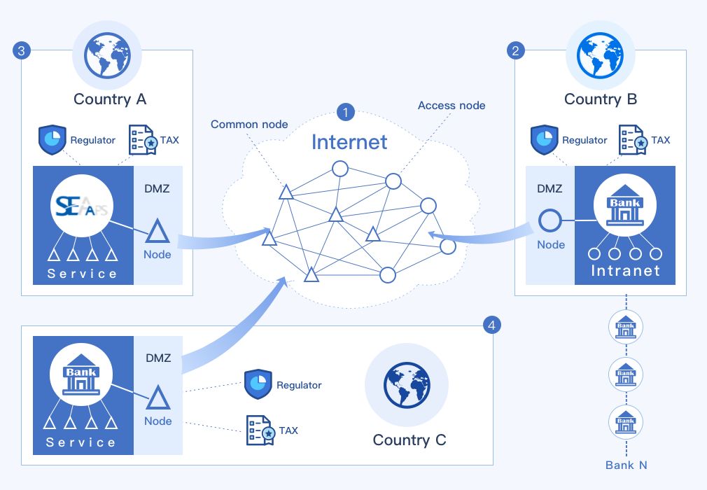

# 安全策略 !heading

众所周知，区块链技术的诞生和发展的过程，和密码学密不可分，然而这并不意味着我们可以随心所欲的使用区块链而不用担心安全问题。

围绕基于区块链的银行业务系统，从底层区块链(智能合约)、应用系统都需要安全策略，并严格的执行。

## 区块链安全

区块链本质上是基于在一个不安全不可信的环境中如何确保数据可信的系统，交易通过交易签名具有不可否认性，账本通过区块连接、P2P网络通信同步和共识算法多种方式来确保账本数据的一致性。

操作区块链的钱包具有地址和密钥两部分，对于使用者来说，必须确保密钥的安全性，不能泄露给第三方。

转移资产时，应当使用钱包密钥对交易进行本地或者离线签名后，发送到区块链节点，不要在网络上传输密钥。

对于长期保管的资产，将其转入冷钱包。冷钱包一旦转移资产，就变成了热钱包，可以建立一个新的冷钱包保存剩余的资产。

对于重大资产的转移，可以通过多签名钱包方式，进行投票，防止单一钱包风险。

## 应用系统安全

传统的安全技术对区块链应用系统仍然有效，例如建立DMZ，在区块链节点服务部署在两道防火墙之间，阻止来自公共网络的嗅探和入侵。

应用系统不可避免的会使用钱包的密钥进行交易签名，应当注意以下事项：

1. 在任何服务器上都不要记录保存密钥
1. 服务端需要交易签名，可以单向传输交易明细到专门的服务器上进行签名，然后取回签名内容进行广播
1. 用户的钱包密钥应当在客户端保存，由用户负责备份，不要保存在服务器上
1. 如果必须在服务器上保存用户密钥，一定用对密钥进行加密后存放，最好是用户口令,salt双重加密
